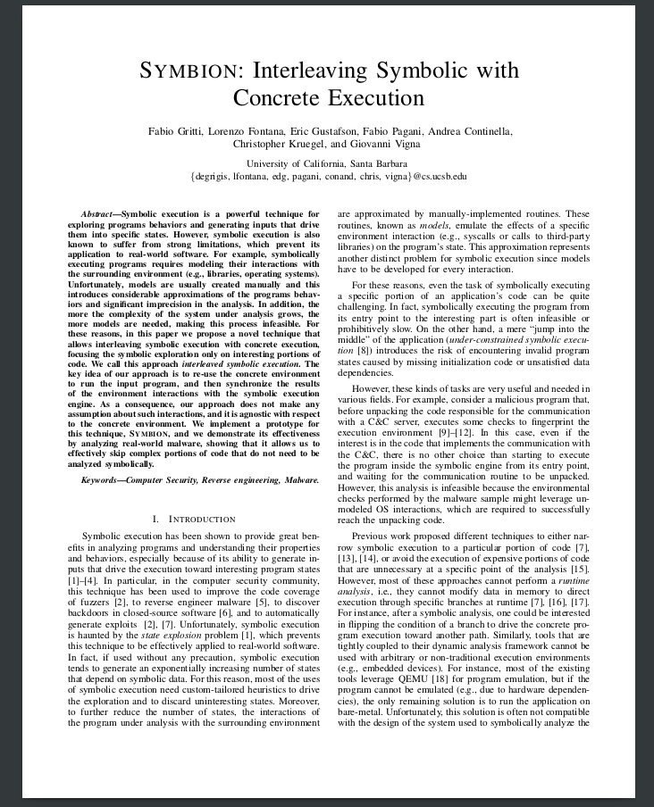

# Symbion: Interleaving Symbolic with Concrete Execution
<a href="">  </a>

This repository contains the malware analysis use cases presented in the paper Symbion. The technique allows interleaving symbolic execution with a concrete execution, focusing the symbolic exploration only on interesting portions of code. 

The <a href="127.0.0.1">Paper</a> and <a href="">Slides</a> describing Symbion were published at CNS 2020. 

The technique is publicly available on <a href="https://github.com/angr/angr">angr</a>'s master.
For a complete example on how to leverage this technique for your analyses refer to our <a href="https://angr.io/blog/angr_symbion/">blog post</a>.

We provide support (ping @degrigis) on using Symbion through our Slack channel, you can ask for an invite <a href="https://angr.io/invite/.">here</a>.


Happy hacking!

## BibTex:
```
@inproceedings{symbion,
  title={Symbion: Interleaving Symbolic with Concrete Execution},
  author={Gritti, Fabio and Fontana, Lorenzo and Gustafson, Eric and Pagani, Fabio and Continella, Andrea and Kruegel, Christopher and Vigna, Giovanni},
  booktitle={IEEE CNS 2020 Conference Proceedings},
  year={2020},
}
```
